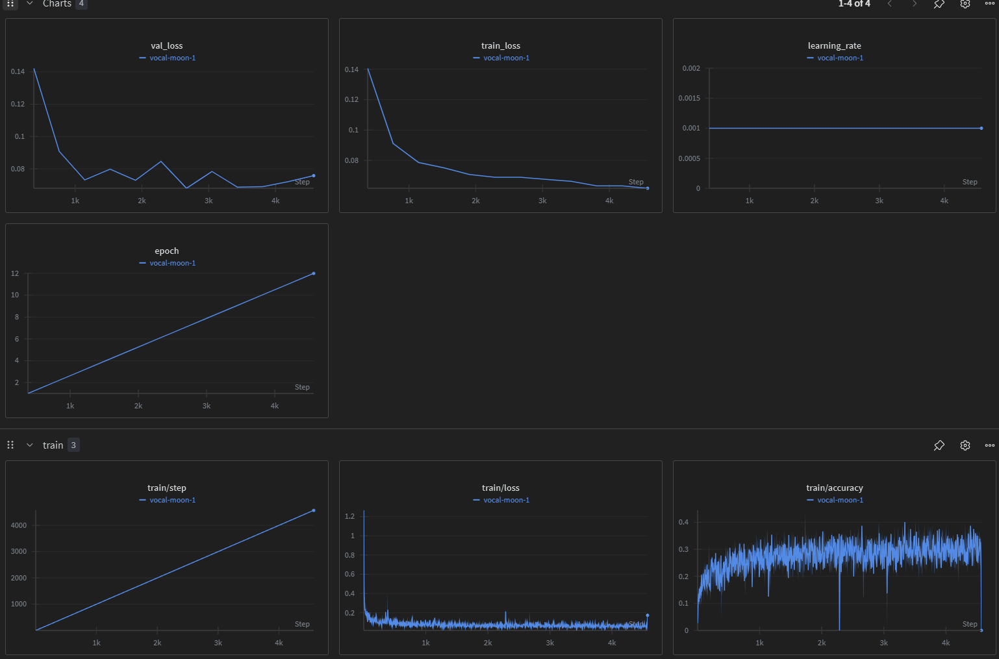
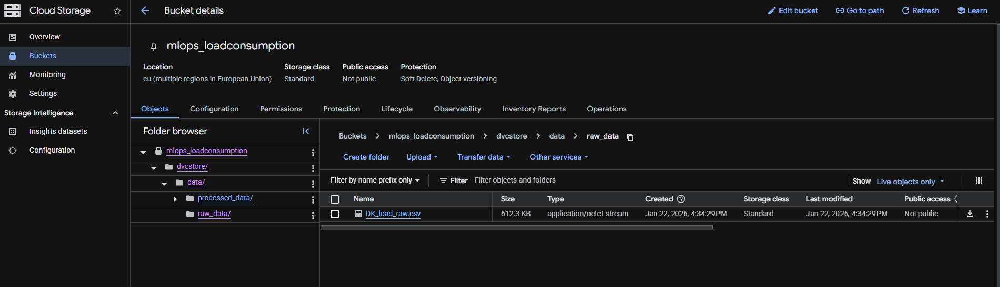
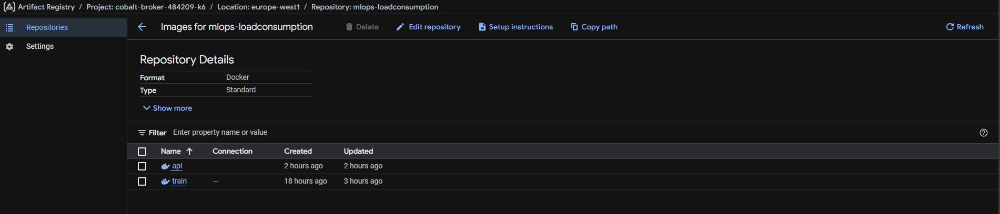
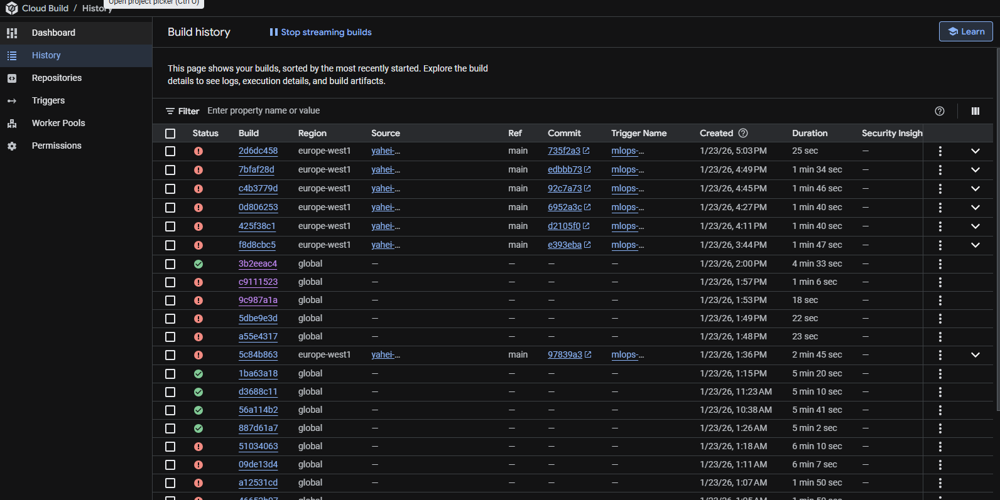

# Exam template for 02476 Machine Learning Operations

This is the report template for the exam. Please only remove the text formatted as with three dashes in front and behind
like:

```--- question 1 fill here ---```

Where you instead should add your answers. Any other changes may have unwanted consequences when your report is
auto-generated at the end of the course. For questions where you are asked to include images, start by adding the image
to the `figures` subfolder (please only use `.png`, `.jpg` or `.jpeg`) and then add the following code in your answer:

``

In addition to this markdown file, we also provide the `report.py` script that provides two utility functions:

Running:

```bash
python report.py html
```

Will generate a `.html` page of your report. After the deadline for answering this template, we will auto-scrape
everything in this `reports` folder and then use this utility to generate a `.html` page that will be your serve
as your final hand-in.

Running

```bash
python report.py check
```

Will check your answers in this template against the constraints listed for each question e.g. is your answer too
short, too long, or have you included an image when asked. For both functions to work you mustn't rename anything.
The script has two dependencies that can be installed with

```bash
pip install typer markdown
```

or

```bash
uv add typer markdown
```

## Overall project checklist

The checklist is *exhaustive* which means that it includes everything that you could do on the project included in the
curriculum in this course. Therefore, we do not expect at all that you have checked all boxes at the end of the project.
The parenthesis at the end indicates what module the bullet point is related to. Please be honest in your answers, we
will check the repositories and the code to verify your answers.

### Week 1

* [x] Create a git repository (M5)
* [x] Make sure that all team members have write access to the GitHub repository (M5)
* [x] Create a dedicated environment for you project to keep track of your packages (M2) - using uv
* [x] Create the initial file structure using cookiecutter with an appropriate template (M6)
* [x] Fill out the `data.py` file such that it downloads whatever data you need and preprocesses it (if necessary) (M6)
* [x] Add a model to `model.py` and a training procedure to `train.py` and get that running (M6)
* [x] Remember to either fill out the `requirements.txt`/`requirements_dev.txt` files or keeping your
    `pyproject.toml`/`uv.lock` up-to-date with whatever dependencies that you are using (M2+M6)
* [x] Remember to comply with good coding practices (`pep8`) while doing the project (M7)
* [x] Do a bit of code typing and remember to document essential parts of your code (M7)
* [x] Setup version control for your data or part of your data (M8)
* [x] Add command line interfaces and project commands to your code where it makes sense (M9)
* [x] Construct one or multiple docker files for your code (M10)
* [x] Build the docker files locally and make sure they work as intended (M10)
* [x] Write one or multiple configurations files for your experiments (M11)
* [x] Used Hydra to load the configurations and manage your hyperparameters (M11)
* [ ] Use profiling to optimize your code (M12)
* [x] Use logging to log important events in your code (M14)
* [x] Use Weights & Biases to log training progress and other important metrics/artifacts in your code (M14)
* [ ] Consider running a hyperparameter optimization sweep (M14)
* [ ] Use PyTorch-lightning (if applicable) to reduce the amount of boilerplate in your code (M15)

### Week 2

* [x] Write unit tests related to the data part of your code (M16)
* [x] Write unit tests related to model construction and or model training (M16)
* [x] Calculate the code coverage (M16)
* [x] Get some continuous integration running on the GitHub repository (M17)
* [x] Add caching and multi-os/python/pytorch testing to your continuous integration (M17)
* [x] Add a linting step to your continuous integration (M17)
* [x] Add pre-commit hooks to your version control setup (M18)
* [x] Add a continues workflow that triggers when data changes (M19)
* [x] Add a continues workflow that triggers when changes to the model registry is made (M19)
* [x] Create a data storage in GCP Bucket for your data and link this with your data version control setup (M21)
* [x] Create a trigger workflow for automatically building your docker images (M21)
* [x] Get your model training in GCP using either the Engine or Vertex AI (M21)
* [x] Create a FastAPI application that can do inference using your model (M22)
* [x] Deploy your model in GCP using either Functions or Run as the backend (M23)
* [x] Write API tests for your application and setup continues integration for these (M24)
* [x] Load test your application (M24)
* [ ] Create a more specialized ML-deployment API using either ONNX or BentoML, or both (M25)
* [ ] Create a frontend for your API (M26)

### Week 3

* [ ] Check how robust your model is towards data drifting (M27)
* [ ] Setup collection of input-output data from your deployed application (M27)
* [ ] Deploy to the cloud a drift detection API (M27)
* [ ] Instrument your API with a couple of system metrics (M28)
* [ ] Setup cloud monitoring of your instrumented application (M28)
* [ ] Create one or more alert systems in GCP to alert you if your app is not behaving correctly (M28)
* [ ] If applicable, optimize the performance of your data loading using distributed data loading (M29)
* [ ] If applicable, optimize the performance of your training pipeline by using distributed training (M30)
* [ ] Play around with quantization, compilation and pruning for you trained models to increase inference speed (M31)

### Extra

* [ ] Write some documentation for your application (M32)
* [ ] Publish the documentation to GitHub Pages (M32)
* [ ] Revisit your initial project description. Did the project turn out as you wanted?
* [ ] Create an architectural diagram over your MLOps pipeline
* [ ] Make sure all group members have an understanding about all parts of the project
* [ ] Uploaded all your code to GitHub

## Group information

### Question 1
> **Enter the group number you signed up on <learn.inside.dtu.dk>**
>
> Answer:

Group 25

### Question 2
> **Enter the study number for each member in the group**
>
> Example:
>
> *sXXXXXX, sXXXXXX, sXXXXXX*
>
> Answer:

s252605, s171204, yahei, mcsr

### Question 3
> **Did you end up using any open-source frameworks/packages not covered in the course during your project? If so**
> **which did you use and how did they help you complete the project?**
>
> Recommended answer length: 0-200 words.
>
> Example:
> *We used the third-party framework ... in our project. We used functionality ... and functionality ... from the*
> *package to do ... and ... in our project*.
>
> Answer:

Yes, we used a couple of open-source packages beyond the core course material:

1. **entsoe-py**: A Python wrapper for the ENTSO-E API to automatically download hourly electricity load data for Denmark, which was critical for our data collection phase.

2. **Plotly**: For interactive data visualization instead of just Matplotlib, helping us better present training results and model analysis.

3. **holidays**: Library to specify if days in time series are part of holidays, which is an important parameter for our model.

4. **tzdata**: For setting timezone correctly when running on windows.

These packages complemented the course material by enabling efficient data collection and better visualization for stakeholder communication.

## Coding environment

> In the following section we are interested in learning more about you local development environment. This includes
> how you managed dependencies, the structure of your code and how you managed code quality.

### Question 4

> **Explain how you managed dependencies in your project? Explain the process a new team member would have to go**
> **through to get an exact copy of your environment.**
>
> Recommended answer length: 100-200 words
>
> Example:
> *We used ... for managing our dependencies. The list of dependencies was auto-generated using ... . To get a*
> *complete copy of our development environment, one would have to run the following commands*
>
> Answer:

We used `uv` for managing our dependencies and virtual environment. We manteined a `pyproject.toml` file that specifies all project dependencies with version dependencies. This approach ensures reproducibility across team members and environments. The exact versions are also pinned in a `requirement.txt` and `requirement_dev.txt` and the uv.lock file, so there is different ways to install the environment, but the easiest is with uv as explained below.


For a new team member to get an exact copy of our environment, they would:

1. Clone the repository from GitHub

2. Install `uv` (if not already installed): `curl -LsSf https://astral.sh/uv/install.sh | sh`

3. Run `uv sync` in the project root directory, which creates a virtual environment and installs all dependencies specified in `pyproject.toml` and locked in `uv.lock`

4. Activate the environment: `source .venv/bin/activate`

The `uv.lock` file ensures that exact versions of all dependencies (including transitive dependencies) are installed. In case the command `uv sync` returns errors concerning the `uv.lock` file, please remove the `uv.lock` file via `rm uv.lock` and then run `uv sync`.

We used Python 3.11 and 3.12 as specified in `requires-python = ">=3.11,<3.13"` in the `pyproject.toml`.

### Question 5

> **We expect that you initialized your project using the cookiecutter template. Explain the overall structure of your**
> **code. What did you fill out? Did you deviate from the template in some way?**
>
> Recommended answer length: 100-200 words
>
> Example:
> *From the cookiecutter template we have filled out the ... , ... and ... folder. We have removed the ... folder*
> *because we did not use any ... in our project. We have added an ... folder that contains ... for running our*
> *experiments.*
>
> Answer:

From the cookiecutter template, we filled out the `src/mlops_loadconsumption/` folder with `data.py`, `model.py`, `train.py`, `visualize.py`, and `api.py` modules. The `data.py` module handles data fetching from the ENTSO-E API and preprocessing. The `model.py` contains our Conv1d neural network architecture, while `train.py` implements the training pipeline with validation and early stopping. We added a `visualize.py` module for interactive plotting using Plotly, and an `api.py` module that creates a FastAPI application for model inference.

We also filled out the `configs/` directory with Hydra configuration files and the `dockerfiles/` folder with containerization files. Additionally, we set up GitHub Actions workflows in `.github/workflows/` for continuous integration, including unit tests, integration tests, data validation, and linting workflows.

The data can be found in `Cloud Storage` through `.dvc`. The final model can be found in `model/`. The dockerfiles are in `dockerfiles/`. We use `cloudbuild.yaml` for `Cloud Build` and `.env` for `wandb`.


### Question 6

> **Did you implement any rules for code quality and format? What about typing and documentation? Additionally,**
> **explain with your own words why these concepts matters in larger projects.**
>
> Recommended answer length: 100-200 words.
>
> Example:
> *We used ... for linting and ... for formatting. We also used ... for typing and ... for documentation. These*
> *concepts are important in larger projects because ... . For example, typing ...*
>
> Answer:

Linting, formatting and pre-commit:

* We used Ruff (version 0.1.3) for both linting and formatting, configured with a 120-character line length in `pyproject.toml`.

* We set up pre-commit hooks that automatically check for trailing whitespace, YAML validation, and large files before each commit.

Typing and docs:

* We implemented type hints for function parameters and return types throughout the codebase.

  * In `data.py`, methods include type annotations like def `__init__(self, n_input_timesteps: int, ...) -> None:`.

  * In `model.py`, the forward method is annotated as `def forward(self, x: torch.Tensor) -> torch.Tensor:`.

  * In `api.py`, we used Pydantic models `(PredictionRequest, PredictionResponse)` for API schema validation with type safety.

* For documentation, we included docstrings for all classes and key methods.

  * The `MyDataset.__init__` has comprehensive docstrings explaining all parameters with their types and purposes.

  * The `Model` class includes docstrings describing the architecture.

  * The API endpoints in `api.py` have detailed docstrings explaining functionality, arguments, and return types.

These concepts are crucial in larger projects because:

1. Type hints catch errors early during development and provide better IDE autocomplete support

2. Ruff formatting reduces merge conflicts, making code reviews focused on logic rather than style

3. Pre-commit hooks enforce quality standards automatically

## Version control

> In the following section we are interested in how version control was used in your project during development to
> corporate and increase the quality of your code.

### Question 7

> **How many tests did you implement and what are they testing in your code?**
>
> Recommended answer length: 50-100 words.
>
> Example:
> *In total we have implemented X tests. Primarily we are testing ... and ... as these the most critical parts of our*
> *application but also ... .*
>
> Answer:

We implemented approximately 39 tests across multiple test files. We primarily tested:

* Data processing (test_data.py): 22 tests covering data directory existence, raw data validation, processed data quality, and train/val/test splits integrity

* Model architecture and training (test_model.py): 3 integration tests verifying that training reduces loss, and gradients flow correctly through all parameters

* Unit tests: 9 tests covering dataset imports, resampling logic, missing value handling, temporal encoding ranges, split size validation and model forward pass with gradient computation

* API endpoints (test_api.py): 5 tests for the health check endpoint, valid/invalid prediction inputs, input shape validation, and response format verification

### Question 8

> **What is the total code coverage (in percentage) of your code? If your code had a code coverage of 100% (or close**
> **to), would you still trust it to be error free? Explain you reasoning.**
>
> Recommended answer length: 100-200 words.
>
> Example:
> *The total code coverage of code is X%, which includes all our source code. We are far from 100% coverage of our **
> *code and even if we were then...*
>
> Answer:

The total code coverage of our project is **42%**, based on the coverage report shown below. Coverage differs substantially across modules. The `api.py` and `model.py` files achieve relatively high coverage (**84%** and **81%**), as these components are critical for inference and were straightforward to test using unit and integration tests. In contrast, `data.py` has very low coverage (**20%**) because it contains extensive logic for external API calls, file system operations, and preprocessing steps that are difficult to test without heavy mocking.

Even with close to **100%** coverage, the code would not be guaranteed to be error-free. Coverage only measures whether lines were executed, not whether edge cases, incorrect assumptions, or failure scenarios were handled correctly. Therefore, code coverage should be interpreted as a supporting metric rather than proof of correctness.

| Module | Statements | Missed | Coverage |
|--------|------------|--------|----------|
| api.py | 58 | 9 | 84% |
| data.py | 174 | 139 | 20% |
| model.py | 37 | 7 | 81% |
| **Total** | 269 | 155 | **42%** |


### Question 9

> **Did you workflow include using branches and pull requests? If yes, explain how. If not, explain how branches and**
> **pull request can help improve version control.**
>
> Recommended answer length: 100-200 words.
>
> Example:
> *We made use of both branches and PRs in our project. In our group, each member had an branch that they worked on in*
> *addition to the main branch. To merge code we ...*
>
> Answer:

In our project, we followed a structured workflow using branches and pull requests (PRs) to manage development efficiently. Separate branches were created for individual tasks, features, or bug fixes, and in many cases, different developers worked on their own branches simultaneously. This approach helped isolate changes and avoid conflicts in the main codebase. Once a task was completed and tested, a pull request was opened to merge the branch into the main branch, allowing for review and discussion before integration. Additionally, we used Dependabot to automatically keep our dependencies up to date. Dependabot regularly (weekly) checked for outdated packages and generated its own branches and pull requests, making it easier to maintain security and stability without manual intervention.

### Question 10

> **Did you use DVC for managing data in your project? If yes, then how did it improve your project to have version**
> **control of your data. If no, explain a case where it would be beneficial to have version control of your data.**
>
> Recommended answer length: 100-200 words.
>
> Example:
> *We did make use of DVC in the following way: ... . In the end it helped us in ... for controlling ... part of our*
> *pipeline*
>
> Answer:

Yes, we used DVC to track exact versions of ENTSO-E API data since it can change when utility companies update it. Because that API data can change or get updated by utility companies, we needed a way to lock it down to ensure our experiments remained consistent.
In the end, it helped us in three ways:

1. We used dvc status to spot API data updates, which told us if we were training on the same data or if the provider had sent us new information

2. It helped us control the preprocessing part of our pipeline by ensuring that our raw files and processed split data always aligned with the specific version of the code we were running

3. It allowed us to time-travel because if a new data update ever broke our model, we could simply jump back to an older Git commit where that data.dvc file pointed and run dvc pull to get the exact data that worked before


### Question 11

> **Discuss you continuous integration setup. What kind of continuous integration are you running (unittesting,**
> **linting, etc.)? Do you test multiple operating systems, Python  version etc. Do you make use of caching? Feel free**
> **to insert a link to one of your GitHub actions workflow.**
>
> Recommended answer length: 200-300 words.
>
> Example:
> *We have organized our continuous integration into 3 separate files: one for doing ..., one for running ... testing*
> *and one for running ... . In particular for our ..., we used ... .An example of a triggered workflow can be seen*
> *here: <weblink>*
>
> Answer:

We organized our continuous integration into 5 separate workflows:

1. Unit Tests (`unit-tests.yaml`): Runs on all pull requests, testing across multiple OS (Ubuntu, Windows, macOS), Python versions (3.11, 3.12), and PyTorch versions (2.2.0, 2.3.0). This creates a test matrix with 3 operating systems × 2 Python versions × 2 PyTorch versions = 12 test combinations, ensuring our code works across different environments. It includes coverage reporting using the `coverage` package.

2. Integration Tests (`integration-test.yaml`): Triggered on pushes/PRs to main that affect the models/ directory. Tests the complete model training workflow on Ubuntu with Python 3.12 and PyTorch 2.3.0.

3. Data Validation (`data-test.yaml`): Runs when data/** or tests/test_data.py changes, validating data quality, format, hourly resolution, and integrity. Ensures that data changes don't break expectations.

4. Code Linting (`linting.yaml`): Runs Ruff linting on pushes/PRs to main, enforcing code style and catching potential bugs before they're merged.

5. Pre-commit Auto-update (`pre-commit-update.yaml`): Scheduled to run daily, automatically updating pre-commit hooks and creating PRs for version updates.

We also configured Dependabot (`dependabot.yaml`) for weekly automated dependency updates across pip, uv, and GitHub Actions.

Caching: We use `cache: 'pip'` in the `actions/setup-python@v6` step across all workflows to speed up dependency installation by caching pip packages between runs.

## Running code and tracking experiments

> In the following section we are interested in learning more about the experimental setup for running your code and
> especially the reproducibility of your experiments.

### Question 12

> **How did you configure experiments? Did you make use of config files? Explain with coding examples of how you would**
> **run a experiment.**
>
> Recommended answer length: 50-100 words.
>
> Example:
> *We used a simple argparser, that worked in the following way: Python  my_script.py --lr 1e-3 --batch_size 25*
>
> Answer:

We used Hydra to keep track of hyperparameter tuning. We stored the default settings in the `config.yaml` file which ensured every experiment was reproducible. By integrating Hydra into `train.py`, we could train with the standard defaults or perform adjustments via the command for hyper-parameter tuning.

To run with default settings via `python src/models/train.py`, and to launch a custom experiment using `uv run train.py batch_size=256 early_stopping_patience=8`.

### Question 13

> **Reproducibility of experiments are important. Related to the last question, how did you secure that no information**
> **is lost when running experiments and that your experiments are reproducible?**
>
> Recommended answer length: 100-200 words.
>
> Example:
> *We made use of config files. Whenever an experiment is run the following happens: ... . To reproduce an experiment*
> *one would have to do ...*
>
> Answer:

We ensured reproducibility through:

* Hydra configuration files: All hyperparameters are stored in `configs/config.yaml`, and Hydra automatically creates timestamped output directories for each run (e.g., `outputs/2025-01-23/14-30-00/`), preserving the exact configuration used for that experiment.

* Logging: We used Python's logging module throughout `data.py` and `train.py` to track data preprocessing steps, training progress, validation metrics, and any errors encountered.

* W&B integration: We logged training/validation loss per epoch and per step, learning rate, model parameter counts, and key hyperparameters to Weights & Biases for long-term experiment tracking and comparison.

* DVC for data versioning: Ensures the exact version of raw and processed data is tracked and can be retrieved.

* Model checkpoints: We save the best model based on validation loss with early stopping, allowing us to recover the exact model state.

### Question 14

> **Upload 1 to 3 screenshots that show the experiments that you have done in W&B (or another experiment tracking**
> **service of your choice). This may include loss graphs, logged images, hyperparameter sweeps etc. You can take**
> **inspiration from [this figure](figures/wandb.png). Explain what metrics you are tracking and why they are**
> **important.**
>
> Recommended answer length: 200-300 words + 1 to 3 screenshots.
>
> Example:
> *As seen in the first image when have tracked ... and ... which both inform us about ... in our experiments.*
> *As seen in the second image we are also tracking ... and ...*
>
> Answer:


We tracked several key metrics in Weights & Biases to monitor model performance and training dynamics:

* Training and Validation Loss: We logged MSE loss for both training and validation sets at each epoch. The training loss shows how well the model fits the training data, while validation loss indicates generalization performance. Monitoring both helps detect overfitting - if validation loss increases while training loss decreases, the model is memorizing rather than learning patterns.

* Per-step Training Metrics: We logged loss and accuracy at every batch step during training (not just per epoch), giving us fine-grained insight into training stability. Sudden spikes in loss can indicate learning rate issues or problematic batches.

* Learning Rate: We tracked the learning rate over time, especially important because we used ReduceLROnPlateau scheduler that automatically reduces learning rate when validation loss plateaus. This helped us understand when the model stopped improving and needed a smaller learning rate to fine-tune.

* Model Configuration: We logged model architecture details (parameter count, n_features, n_timesteps, n_outputs) and training hyperparameters (batch_size, initial learning_rate, epochs) to compare different experimental configurations.

* Train accuracy: We tracked the accuracy of the model in each training step. We can see that is increasing and converging as it is expected from model training.




### Question 15

> **Docker is an important tool for creating containerized applications. Explain how you used docker in your**
> **experiments/project? Include how you would run your docker images and include a link to one of your docker files.**
>
> Recommended answer length: 100-200 words.
>
> Example:
> *For our project we developed several images: one for training, inference and deployment. For example to run the*
> *training docker image: `docker run trainer:latest lr=1e-3 batch_size=64`. Link to docker file: <weblink>*
>
> Answer:

In our project, we used Docker to create a consistent and isolated environment for model training, ensuring that all dependencies for our `train.py` script were correctly configured regardless of the host system. We organized our project by storing our configuration in a `dockerfiles/train.dockerfile`.

To run the experiment, we first built the image from the `train.dockerfile` and then launched a container to execute the training.

To build the image, we run:
``` bash
docker build --platform linux/arm64 -f ./dockerfiles/train.dockerfile . -t train:latest
```

And then we start the image and run `train.py` via:
``` bash
docker run --platform linux/arm64 train:latest
```

This approach allowed us to package the exact versions of libraries like PyTorch or TensorFlow, preventing version conflicts. Link to docker file: <https://github.com/yahei-DTU/mlops_loadconsumption/blob/main/dockerfiles/train.dockerfile>

To run a docker process on the cloud, we use the `cloudbuild.yaml` file which specifies which dockerfile should be build on `Cloud Build`. It can be run by the following command:

``` bash
gcloud builds submit --config dockerfiles/cloudbuild.yaml
```

### Question 16

> **When running into bugs while trying to run your experiments, how did you perform debugging? Additionally, did you**
> **try to profile your code or do you think it is already perfect?**
>
> Recommended answer length: 100-200 words.
>
> Example:
> *Debugging method was dependent on group member. Some just used ... and others used ... . We did a single profiling*
> *run of our main code at some point that showed ...*
>
> Answer:

Within the group we generally use two different methods for debigging:

* **Jupyter interactive window**: To access this debugging method, one would simply run the filw with the option "Run in interactive window". The advantages are that the code would be ran as a jupyter notebook, making available all the variables used in the workspace. The cons is that this approach is slow in execution since one would have to wait to initialize first the jupyter kernel.

* **Built-in VS Code debugger**: The main tool in VS Code. A steep learning curve at the beginning, but once some confidence has been established with this tool, it was the go-to for all group members.

## Working in the cloud

> In the following section we would like to know more about your experience when developing in the cloud.

### Question 17

> **List all the GCP services that you made use of in your project and shortly explain what each service does?**
>
> Recommended answer length: 50-200 words.
>
> Example:
> *We used the following two services: Engine and Bucket. Engine is used for... and Bucket is used for...*
>
> Answer:

We used the following six services: Compute Engine, Cloud Storage, Artifact Registry, Cloud Build, Cloud Logging, and Identity and Access Management (IAM).
Compute Engine is used to create and manage the Virtual Machines (VMs) that host the core application logic and processing power.
Cloud Storage is used as our "digital warehouse" for storing and retrieving data objects, such as images, files, and large datasets.
Artifact Registry is used as a secure, private location to store and manage our container images (Docker) and software packages.
Cloud Build is used as our CI/CD engine that automatically builds, tests, and deploys our code whenever updates are made.
Cloud logging is used to automatically collect and store system logs, enabling us to monitor the operational status of services and troubleshoot problems.
Identity and Access Management (IAM) is used to manage permissions and security, ensuring only authorized users and services can access specific resources.

### Question 18

> **The backbone of GCP is the Compute engine. Explained how you made use of this service and what type of VMs**
> **you used?**
>
> Recommended answer length: 100-200 words.
>
> Example:
> *We used the compute engine to run our ... . We used instances with the following hardware: ... and we started the*
> *using a custom container: ...*
>
> Answer:

We used the Compute Engine to run our machine learning model training and data processing tasks.  We used instances with the following hardware: primarily the n1-standard-1 machine type, which provided 1 vCPU and 3.75 GB of memory.

This offered a balanced, cost-effective setup for our standard tasks. For specialized AI needs, we also utilized Deep Learning VMs like my-new-deeplearning-vm, which comes pre-configured with essential drivers and frameworks like TensorFlow.

We also started the instances using a custom container by pulling our Docker images from the Artifact Registry. These were run on a stable Debian 12 operating system to ensure our environment stayed perfectly consistent across development and training stages.

### Question 19

> **Insert 1-2 images of your GCP bucket, such that we can see what data you have stored in it.**
> **You can take inspiration from [this figure](figures/bucket.png).**
>
> Answer:



### Question 20

> **Upload 1-2 images of your GCP artifact registry, such that we can see the different docker images that you have**
> **stored. You can take inspiration from [this figure](figures/registry.png).**
>
> Answer:



### Question 21

> **Upload 1-2 images of your GCP cloud build history, so we can see the history of the images that have been build in**
> **your project. You can take inspiration from [this figure](figures/build.png).**
>
> Answer:




### Question 22

> **Did you manage to train your model in the cloud using either the Engine or Vertex AI? If yes, explain how you did**
> **it. If not, describe why.**
>
> Recommended answer length: 100-200 words.
>
> Example:
> *We managed to train our model in the cloud using the Engine. We did this by ... . The reason we choose the Engine*
> *was because ...*
>
> Answer:

We managed to train our model in the cloud using Compute Engine. We chose the Engine over Vertex AI mainly because we wanted total control over the environment; it allowed us to pick our own operating system (Debian 12) and manually monitor the hardware as the model trained.
To get it running, we first packaged all our code and libraries into a Docker container and pushed it to the Artifact Registry. Then, we launched an n1-standard-1 VM instance. We configured the VM to pull that specific container image and start running the training script immediately. This was the best approach for us because it kept our setup consistent—what worked on our local machines worked the same way in the cloud, making debugging a lot easier.

## Deployment

### Question 23

> **Did you manage to write an API for your model? If yes, explain how you did it and if you did anything special. If**
> **not, explain how you would do it.**
>
> Recommended answer length: 100-200 words.
>
> Example:
> *We did manage to write an API for our model. We used FastAPI to do this. We did this by ... . We also added ...*
> *to the API to make it more ...*
>
> Answer:
We wrote the API using FastAPI because it is lightweight, fast, and works very naturally with Python ML workflows. The API wraps the trained PyTorch model and exposes it through a `/predict` endpoint for inference and a `/health` endpoint for monitoring.

One important design choice was loading the model once at startup using FastAPI’s `startup` event. This avoids reloading the model on every request, which would be slow and inefficient. I also kept the model in a global variable so it can be reused across requests. The model file is loaded from disk, set to evaluation mode, and mapped to CPU to keep deployment simple and portable.

Another key aspect was input validation. I used Pydantic models to define clear request and response schemas and added explicit shape checks to ensure the input matches what the Conv1D model expects (96 timesteps × 12 features). I also handled tensor reshaping carefully for Conv1D compatibility.

Overall, the API is simple but production-aware, with logging, error handling, health checks, and clean separation between model loading and inference.


### Question 24

> **Did you manage to deploy your API, either in locally or cloud? If not, describe why. If yes, describe how and**
> **preferably how you invoke your deployed service?**
>
> Recommended answer length: 100-200 words.
>
> Example:
> *For deployment we wrapped our model into application using ... . We first tried locally serving the model, which*
> *worked. Afterwards we deployed it in the cloud, using ... . To invoke the service an user would call*
> *`curl -X POST -F "file=@file.json"<weburl>`*
>
> Answer:
We could not deploy the model on cloud due to authentification errors and limited time at the end to fix these issues. However, we managed to deploy the api locally.
##### Maria continues here


### Question 25

> **Did you perform any unit testing and load testing of your API? If yes, explain how you did it and what results for**
> **the load testing did you get. If not, explain how you would do it.**
>
> Recommended answer length: 100-200 words.
>
> Example:
> *For unit testing we used ... and for load testing we used ... . The results of the load testing showed that ...*
> *before the service crashed.*
>
> Answer:

--- question 25 fill here ---

### Question 26

> **Did you manage to implement monitoring of your deployed model? If yes, explain how it works. If not, explain how**
> **monitoring would help the longevity of your application.**
>
> Recommended answer length: 100-200 words.
>
> Example:
> *We did not manage to implement monitoring. We would like to have monitoring implemented such that over time we could*
> *measure ... and ... that would inform us about this ... behaviour of our application.*
>
> Answer:

--- question 26 fill here ---

## Overall discussion of project

> In the following section we would like you to think about the general structure of your project.

### Question 27

> **How many credits did you end up using during the project and what service was most expensive? In general what do**
> **you think about working in the cloud?**
>
> Recommended answer length: 100-200 words.
>
> Example:
> *Group member 1 used ..., Group member 2 used ..., in total ... credits was spend during development. The service*
> *costing the most was ... due to ... . Working in the cloud was ...*
>
> Answer:

The most expensive part was Compute Engine. Since we had our n1-standard-1 instances and those specialized Deep Learning VMs running for long stretches to train our models, the uptime costs really added up. After that, networking and the VM manager were the next biggest expenses, while Cloud Storage was the cheapest since our datasets weren't huge.
Overall, we really liked working in the cloud. The best part was the flexibility. It was great being able to launch a powerful machine in minutes rather than needing a high-end setup at home.
However, there was definitely a learning curve when it came to managing the budget and figuring out all the different APIs. We also found IAM pretty frustrating to deal with—it felt like every time we tried to set something up, we ran into a permission error or a binding issue. But having everything in one place and getting access to professional AI tools really helped the whole project come together in the end.

### Question 28

> **Did you implement anything extra in your project that is not covered by other questions? Maybe you implemented**
> **a frontend for your API, use extra version control features, a drift detection service, a kubernetes cluster etc.**
> **If yes, explain what you did and why.**
>
> Recommended answer length: 0-200 words.
>
> Example:
> *We implemented a frontend for our API. We did this because we wanted to show the user ... . The frontend was*
> *implemented using ...*
>
> Answer:

Due to time limitations, we limited this project to comply solely with the main TODOs, prioritizing the core modules and negleting the extra features.

### Question 29

> **Include a figure that describes the overall architecture of your system and what services that you make use of.**
> **You can take inspiration from [this figure](figures/overview.png). Additionally, in your own words, explain the**
> **overall steps in figure.**
>
> Recommended answer length: 200-400 words
>
> Example:
>
> *The starting point of the diagram is our local setup, where we integrated ... and ... and ... into our code.*
> *Whenever we commit code and push to GitHub, it auto triggers ... and ... . From there the diagram shows ...*
>
> Answer:

Instead of a figure, which we don't have time for anymore, we make a list of services that we used:
 * git
 * uv
 * dvc
 * docker
 * GCP
 * hydra
 * wandb
 * dependabot
 * pre-commit

### Question 30

> **Discuss the overall struggles of the project. Where did you spend most time and what did you do to overcome these**
> **challenges?**
>
> Recommended answer length: 200-400 words.
>
> Example:
> *The biggest challenges in the project was using ... tool to do ... . The reason for this was ...*
>
> Answer:

We can identify some main challenges:

* **Google Cloud Platform**: We spent a lot of time debugging errors coming from the usage of the cloud. We didn't manage to deploy the api on the cloud due to limited time and continuosly getting errors when trying to run it.

* **ENTSOE-py API**: The api from entsoe-py had a bug that was discovered, ironically, on the submission day. The bug was related to a typo in the capitalization of the timezone for the retrieval of the electricity load data. We managed to find and correct that bug with a patch (in the first lines of data.py). After the course, we will open a PR to the entsoe-py library and make our own contribution there.

### Question 31

> **State the individual contributions of each team member. This is required information from DTU, because we need to**
> **make sure all members contributed actively to the project. Additionally, state if/how you have used generative AI**
> **tools in your project.**
>
> Recommended answer length: 50-300 words.
>
> Example:
> *Student sXXXXXX was in charge of developing of setting up the initial cookie cutter project and developing of the*
> *docker containers for training our applications.*
> *Student sXXXXXX was in charge of training our models in the cloud and deploying them afterwards.*
> *All members contributed to code by...*
> *We have used ChatGPT to help debug our code. Additionally, we used GitHub Copilot to help write some of our code.*
> Answer:

* Student `s252605` contributed with:
  * TO BE FILLED

* Student `s171204` contributed with:
  * TO BE FILLED

* Student `mcsr` contributed with:
  * Data API to fetch electricity demand data
  * Curated the tests for the data.py script together with unit_tests
  * General code formatting adjustments

* Student `yahei` contributed with:
  * Setting up workflows
  * Writing integration tests
  * Hydra configuration setup
  * Setting up Weights and Bias
  * DVC on Cloud Storage
  * Docker images on Artifactory Registry
  * API deployment with Cloud Run


* Mainly together we have:
  * Debugged code
  * Set up cookie cutter template

While we have mostly debugged the code ourself, we have also done use of AI tools as ChatGPT and Claude for the more tedious debugging issues.
